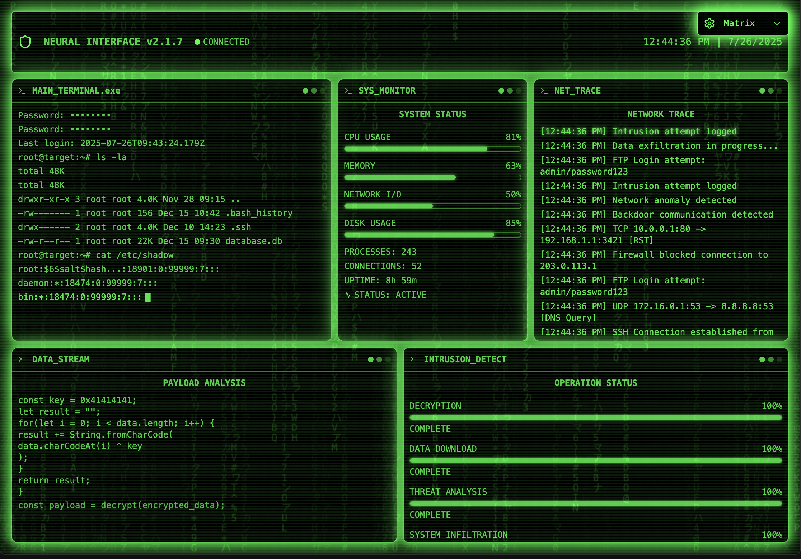

# CyberCine



A modern web application built with Vite, React, TypeScript, and Tailwind CSS.

## Features
- Fast development with Vite
- Type-safe code with TypeScript
- Utility-first styling with Tailwind CSS

## Getting Started

### Prerequisites
- Node.js (v16 or higher recommended)
- npm (v8 or higher)

### Installation

```bash
npm install
```

### Development

Start the development server:

```bash
npm run dev
```

### Build

Build the app for production:

```bash
npm run build
```

### Preview

Preview the production build:

```bash
npm run preview
```

## Project Structure

- `src/` - Source code (components, styles, etc.)
- `public/` - Static assets
- `index.html` - Main HTML file

## License

This project is licensed under the MIT License. 